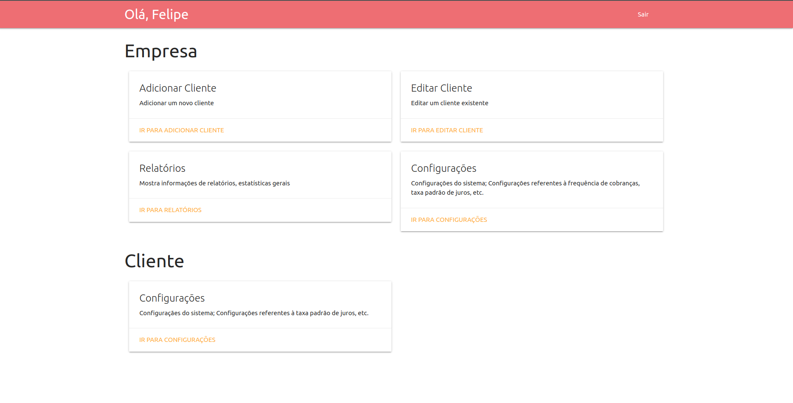

# Um pequeno site para Gerenciamento de Cobrança de Aluguéis
## Apresentação
Imagine que você é uma empresa terceirizada e que precisa fazer cobranças de pagamentos atrasados aos moradores de imóveis que a empresa te contratou possui. Para organizar isto, a empresa se dispôs à preencher os dados de imóveis (localização, valor, taxa de administração, etc) e seus respectivos moradores. Agora, você carece de uma ferramenta para visualizar estes dados e fazer envio de emails de aviso atuomáticamente e gerenciar todas as empresas na qual vocẽ é contratado.

Para isto, vem este site.


## Instalação
### Pré-requisitos
O site foi programado utilizando Python 3, JavaScript e SQL, portanto, faz-se nescessário:
* Python 3.7 ou superior
* MySQL

Para fazer instalação dos pré-requisitos do Python 3, execute:

```bash
python3 -m pip install -r requirements.txt
```

#### Variáveis do Ambiente
As variáveis estaõ contidas em `.env.example` (remova o `.example` do final e edite suas informações)

* `SECRET_KEY`: chave secreva de criptografia de dados do site, escolha chave segura.
* `DB_NAME`: Nome do banco de dados que será escrito no MySQL (cuidado, os próximos passos irá apagar qualquer DB existente que tenha este mesmo nome)
* `DB_HOST`: URL/IP de acesso ao MySQL
* `DB_PORT`: Porta de acesso ao MySQL
* `DB_USER`: Usuário de acesso ao MySQL (deve ter permissão de escrita e leitura)
* `DB_PASSWORD`: Senha de acesso do usuário MySQL

#### Criação do Esquema do DB e Superusuário
Para criar o schema do banco de dados utilize o comando
```bash
python3 -m flask --app website init-db
```
Isto irá criar todas as tabelas e adicionar informações no MySQL para funcionamento do site (inicializa o db)

Agora, iremos criar um usuário de acesso usando o comando 
```bash
python3 -m flask --app website createsuperuser
```
(basta responder as perguntas para cadastrar ADM)

### Iniciando o Site
Tendo todos os pré-requisitos, basta iniciar o site utilizando
```
python3 -m flask --app website run
```
Para mais informações sobre como definir porta de saída do site, verifique este link: https://stackoverflow.com/a/41940807



